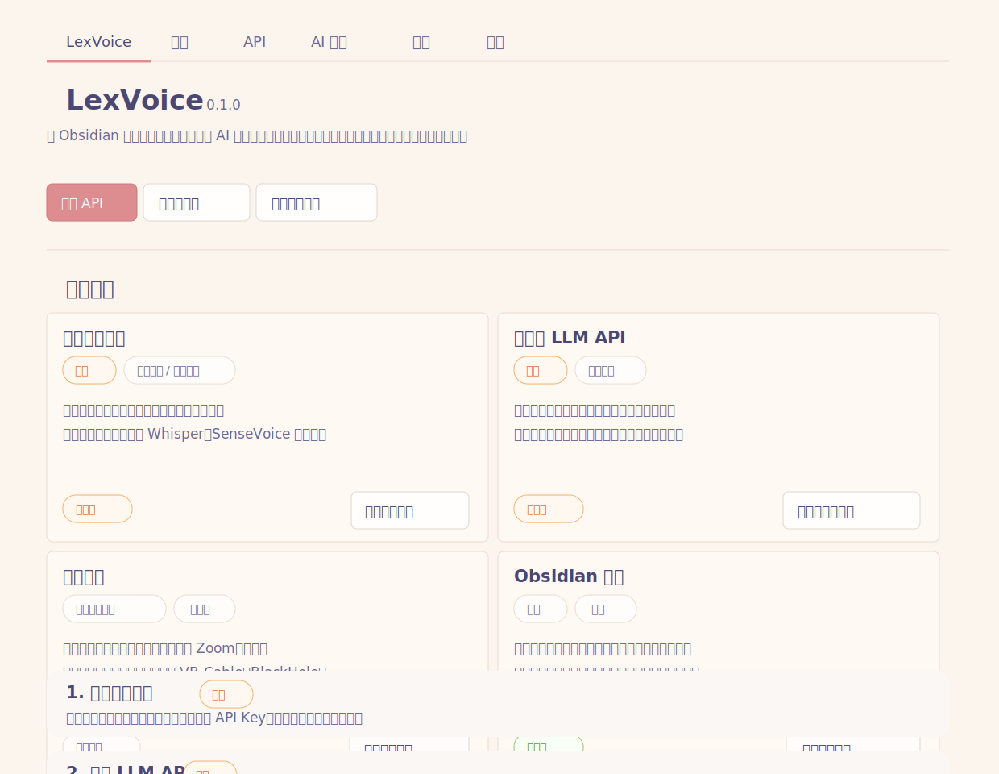

# LexVoice

[English](README.md) | [简体中文](README.zh-CN.md)

LexVoice is an Obsidian desktop plugin for recording audio, transcribing speech, building live outlines, and turning meeting material into reusable Markdown objects.

It is not a hosted cloud service and it does not include API keys. LexVoice connects recording, transcription, AI organization, object extraction, and local vault writing. You choose and configure your own transcription and large-language-model services.

## 1.2.0: I Came Back With 10,000 Lines Of Code

This is not a “small patch with two buttons and a wording tweak” release. LexVoice 1.2.0 is a major feature rebuild with more than ten thousand lines of code changes. It turns LexVoice from a recording-and-transcription plugin into a meeting workspace inside Obsidian.

The old core flow was: record audio, transcribe it, generate a note. The new goal is broader: turn a meeting from sound into structure, from structure into actions, and from actions into reusable knowledge objects.

### Product Direction

- **Recording is only the entry point**: the real value is in live outlines, playback anchors, sediment candidates, and deliverables.
- **AI should not just dump text**: it should split a meeting into objects that can be reviewed, edited, and committed.
- **The sidebar is now the workspace**: outline, sediment review, and note navigation live in one continuous flow.
- **Obsidian is not an attachment folder**: todos, learning cards, people, and hotwords should become reusable local knowledge objects.

### Major Feature Rebuilds

- **Live outline rebuild**: generate chapters while recording, then replay by timeline after the meeting.
- **Sediment workflow**: scan one note into people, todos, learning cards, and hotwords.
- **Object libraries**: turn action items, knowledge points, people, and ASR terms into reusable Obsidian objects.
- **Todo capture upgrade**: todos can carry owners, dates, subtasks, and Markdown task output.
- **Real microphone protection**: detect and avoid virtual audio devices polluting microphone input.
- **Input meters are back**: confirm whether computer audio and microphone audio are actually coming in.
- **Export pipeline**: generate HTML reports, HTML slides, editable PPTX files, and email drafts from the same note.
- **Timeline note navigation**: browse recent notes from the sidebar with week filters, template filters, current-note highlighting, and linked-audio deletion.

### Fixes And Polish

- Fixed template classification issues where some template notes were treated as recordings.
- Improved recruiting evaluation, text import, and failed-organization states.
- Improved sediment scan, processing, cancel, and rescan feedback.
- Added the option to delete linked audio when deleting a transcription record.
- Reworked sidebar context menus to better match Obsidian conventions.
- Tightened spacing, tab order, playback UI, timelines, and candidate list density.
- Moved the color system back to Obsidian / Style Settings variables to reduce theme mismatch.

### Vision

LexVoice is not trying to be just “audio to text.” It is a post-meeting workspace: recording preserves the source, outlines make it understandable, sediment review turns it into decisions, object libraries make it reusable, and exports turn it into deliverables. The goal is for every discussion to enter your Obsidian workflow naturally instead of becoming another transcript you never open again.

## Highlights

### Live Outline

- Build an outline while recording.
- Show a clickable chapter timeline for playback and review.
- Display audio input meters so you can confirm that microphone and computer audio are actually being captured.
- Finalize the outline and note after recording ends.

### Sediment Workflow

- The sidebar is organized around `Outline / Sediment / Notes`.
- The Sediment tab scans a note into four candidate groups: people, todos, learning cards, and hotwords.
- People are reviewed one by one: keep, merge, or ignore.
- Todos, learning cards, and hotwords support multi-select confirmation.
- Completed groups can be reviewed and reprocessed.
- Commit actions show a toast with view and undo actions.

### Reusable Object Libraries

- Learning cards for concepts, mechanisms, cases, Q&A, follow-up questions, and opinions.
- Todo cards for action items, with optional owner, date, and subtasks.
- People suggestions for reusable contact/person records.
- ASR hotwords for names, brands, organizations, and domain terms.
- Learning-card wall, concept wall, and todo wall entry points.

### Real Microphone Protection

- Mixed recording separates computer audio from the real microphone.
- LexVoice avoids treating `CABLE Output`, `BlackHole`, `VoiceMeeter`, `Stereo Mix`, and similar virtual inputs as the microphone.
- Settings include real-microphone selection and device diagnostics.
- Input meters help identify wrong microphone or virtual-audio routing before transcription fails.

### Export And Sharing

- Generate an HTML report from the current note.
- Generate an HTML slide deck.
- Generate an editable PPTX deck.
- Generate an `.eml` email draft with Markdown, PDF, and generated report or deck attachments.

### Note Navigation

- Recent notes are shown as a date timeline in the sidebar.
- Default filter focuses on this week; template filtering is available.
- The current note is highlighted.
- Deleting a transcription record can optionally delete linked audio files.

## Who It Is For

- People who frequently turn meetings into notes, decisions, action items, and follow-up work.
- Interviewers, researchers, recruiters, and consultants who need structured records.
- Learners who want to turn courses, videos, talks, and lectures into reusable notes.
- Obsidian users who want recordings, transcripts, notes, and extracted objects to stay inside the local vault.
- Users who prefer local transcription or local LLMs for sensitive content.

## Basic Workflow

1. Open the LexVoice sidebar.
2. Choose a template and audio input mode.
3. Start recording and confirm that input meters are moving.
4. Review the live outline while the session is running.
5. Stop recording and let LexVoice finalize the note.
6. Open Sediment and confirm people, todos, learning cards, and hotwords.
7. Export HTML reports, slide decks, PPTX files, or email drafts when needed.

Default storage paths:

- Recordings: `LexVoice/录音`
- Transcription notes: `LexVoice/转写纪要`
- Learning cards: `LexVoice/学习卡片`
- Todo cards: `LexVoice/待办`
- Email drafts: `LexVoice/邮件草稿`
- Vocabulary file: `LexVoice/词汇表.md`

All paths can be changed in settings.

## What You Need

Required:

- Obsidian desktop app
- A speech-to-text service, either cloud-based or local
- A folder in your vault for recordings
- A folder in your vault for generated notes

Optional but recommended:

- A large-language-model API for outlines, summaries, sediment extraction, reports, exports, translations, and custom templates
- A virtual audio device for recording online meetings, videos, browser audio, or other computer playback
- A real microphone for mixed recording
- A vocabulary file for domain terms, names, products, and abbreviations

## First-Time Setup



Suggested setup order:

1. Configure the transcription service.
2. Confirm storage folders for recordings, notes, learning cards, todo cards, and vocabulary.
3. Configure an LLM endpoint if you want AI organization, live outlines, sediment extraction, reports, and exports.
4. Choose an audio input mode: microphone only, computer audio only, or microphone plus computer audio.
5. Run device diagnostics and confirm that the input meters move.
6. Tune templates, daily-note integration, vocabulary, and custom prompts.

The minimum usable setup is transcription service plus storage paths. The full workflow needs LLM configuration and correct audio routing.

## Audio Input And Real Microphone

Obsidian desktop cannot reliably capture system audio directly across platforms. To record online meetings, courses, Bilibili, YouTube, browser videos, or other playback, route that playback through a virtual audio device and select it in LexVoice.

Common tools:

- Windows: VB-Cable
- macOS: BlackHole
- Linux: PulseAudio or PipeWire monitor sources

On Windows, `CABLE Input` is a playback/output device. Set the meeting app, browser, or system output to `CABLE Input`; LexVoice records the matching `CABLE Output`, which appears as a recording/input device.

If you also need your own voice, choose a real microphone in LexVoice's real-microphone setting. Do not choose `CABLE Output`, `BlackHole`, `VoiceMeeter`, or `Stereo Mix` as the real microphone. If meters do not move while recording, run device diagnostics first.

## AI Organization And Templates

AI organization is optional. Without it, LexVoice still saves audio and transcript text. With it, LexVoice can produce structured notes, live outlines, sediment candidates, reports, slide decks, and prompt-optimized outputs.

Built-in templates cover work notes, learning notes, interviews, recruiting evaluation, and personal notes. Custom templates can be created and reused in recording, import, and re-organize flows.

A useful template should specify:

- The content scenario
- Which information matters most
- Whether decisions, todos, risks, questions, or follow-up items are required
- Whether translation or bilingual output is needed
- Who will use the output next

## Import And Re-Organize

- Import existing audio and transcribe it.
- Import existing text or Markdown and organize it without recording.
- Re-organize an existing note with another template.
- Add extra preference instructions for a re-organization pass.

## Exports

LexVoice can turn the same note into multiple deliverables:

- HTML report for reading, printing, sharing, or archiving
- HTML slide deck for presentation
- Editable PPTX for further editing in PowerPoint
- `.eml` email draft with summary and related attachments

Export folders are configurable in settings.

## Diagnostics

LexVoice can copy a diagnostic report for troubleshooting transcription, queues, LLM calls, audio devices, and local settings.

The report redacts common API keys, tokens, user folders, and vault paths. It does not include audio, transcript body, or full prompts.

## Installation

1. Close Obsidian.
2. Put this folder under your vault:

   ```text
   <your vault>/.obsidian/plugins/lexvoice/
   ```

3. Start Obsidian.
4. Open Settings -> Community plugins and enable LexVoice.
5. Open LexVoice settings and configure transcription before recording.

Do not publish or share your local `data.json`. It may contain API keys and user settings.

## Privacy

LexVoice has no analytics, ads, or telemetry. It stores settings locally in `.obsidian/plugins/lexvoice/data.json`.

LexVoice does not operate its own cloud storage service and does not upload recordings to a LexVoice server. Recording files are saved only to the local Obsidian vault path you choose.

When you use transcription or AI features, the relevant audio, transcript, and prompt context are sent to the cloud API provider or local model endpoint you configure. Review your provider's privacy policy and obtain consent before recording or processing sensitive conversations.

For confidential, private, client, medical, legal, HR, or regulated content, prefer local speech-to-text and a local large-language model instead of cloud APIs.

See [PRIVACY.md](PRIVACY.md) for details.

## Open Source And Notices

This project is released under the MIT License. See [LICENSE](LICENSE).

Third-party services and tools mentioned in the plugin are optional integrations or setup references, not bundled dependencies. See [THIRD_PARTY_NOTICES.md](THIRD_PARTY_NOTICES.md).

### Design Inspiration

The HTML PPT feature was inspired by the HTML-first slide-deck workflow and design principles documented in [alchaincyf/huashu-design](https://github.com/alchaincyf/huashu-design). In the language requested by that project's license notice: **Derived from alchaincyf/huashu-design**.

LexVoice does not bundle or redistribute `huashu-design` source code, scripts, assets, demos, or media. The LexVoice implementation is an independent renderer and prompt workflow written for this plugin. See [THIRD_PARTY_NOTICES.md](THIRD_PARTY_NOTICES.md) for the attribution and license-scope note.

## Known Limitations

- Desktop only.
- Mobile Obsidian is not supported.
- Local transcription requires a separate local service.
- System or meeting audio usually requires a virtual audio device.
- API keys live in local plugin settings; do not commit `data.json`.

## Development

LexVoice follows the standard Obsidian plugin build layout: edit the source in `src/main.ts`, run `npm install`, then use `npm run dev` while developing or `npm run build` before publishing. The generated `main.js` is kept in the repository because Obsidian loads that file directly and GitHub releases distribute `manifest.json`, `main.js`, and `styles.css`.

## Release Checklist

Before publishing a release:

- Confirm `data.json` is not committed.
- Rotate any API key that was previously committed or shared.
- Include `manifest.json`, `main.js`, `styles.css`, `README.md`, `README.zh-CN.md`, `LICENSE`, `PRIVACY.md`, `SECURITY.md`, and `THIRD_PARTY_NOTICES.md`.
- Verify `manifest.json` has a unique plugin id and a semantic version.
- Test the plugin in a separate Obsidian vault.
