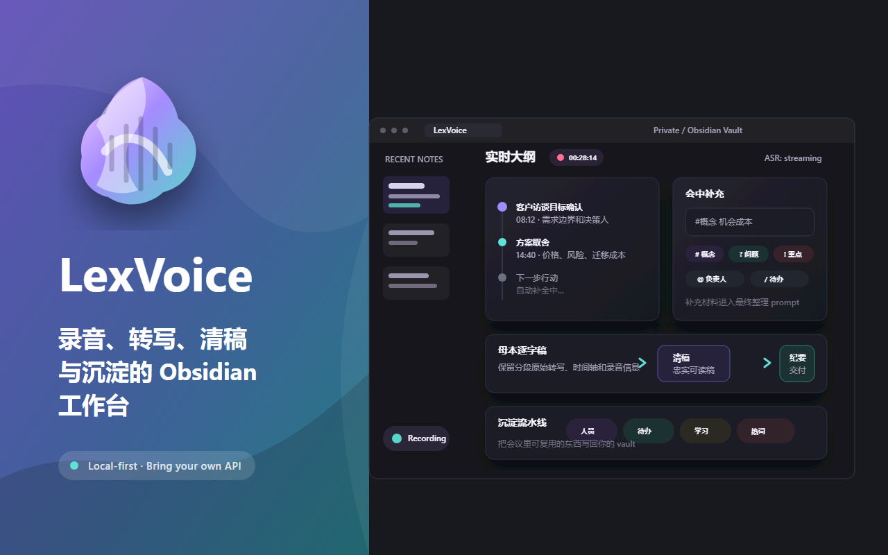

# LexVoice

[English](README.md) | 简体中文 · [中文文档站](https://lexvoice.cn/zh/)

  

LexVoice 是一款 Obsidian 插件，用于录音、语音转写、录音中的实时大纲，以及把会议内容整理成可复用的 Markdown：待办、学习卡片、人员档案和 ASR 热词。

LexVoice **不是云服务**，也不内置任何 API Key。你需要连接自己的语音转写服务（ASR），并可选连接自己的大语言模型服务（LLM）。录音保存在你的知识库中；LexVoice 没有自己的服务器，也不会把内容上传到所谓的 LexVoice 云端。

LexVoice 最初只是一个“录音 → 转写 → 总结”工具。但会议真正值得留下的，通常不是一篇很少再打开的转写稿，而是谁说了什么、接下来要做什么、学到了什么，以及以后还会反复遇到哪些术语。因此，LexVoice 逐步变成了一个**会议工作台**：录音是入口，实时大纲、沉淀工作流和对象库才是会议结束后继续发挥价值的部分。

LexVoice 支持 Obsidian 桌面端和移动端。移动端录音使用设备麦克风；电脑音频、虚拟声卡、多声道采集和桌面设备检测需要使用桌面端。

## 功能

### 实时大纲

录音时，章节会随着会议内容逐步生成，不必等到录音结束才知道刚才讨论了什么。录音结束后，大纲章节会与播放器联动；点击章节即可跳转到对应的录音位置。停止录音后，AI 会继续补全并整理最终纪要。

### 会中纪要

录音过程中，可以在大纲下方随时补充现场笔记。输入内容的首字符会触发不同处理方式。

调用 AI 助手：

- `#概念`：遇到不熟悉的术语时，AI 会结合当前讨论解释其含义。
- `?问题`：AI 会根据当前转写和大纲回答问题。
- `!重点`：标记需要重点保留的内容，并在最终纪要中优先处理。

只做标记，不调用 AI：

- `@指派人`：记录事项由谁跟进，最终整理待办时会优先关联对应人员。
- `/待办`：把现场记录明确标记为待办候选。

半角和全角符号都可以识别。会中补充会作为标注清楚的“现场补充材料”进入最终整理，不会混入原始转写正文。

### 问一问

当最终纪要遗漏了某个细节，或者你想重新核对会议中的特定内容时，可以直接针对当前纪要提问。LexVoice 会同时参考整理后的纪要和保留的原始转写。觉得有价值的回答可以写回 Markdown，并统一收纳在一个紧凑的“问一问”章节中。

### 长会议与失败恢复

在普通会议和学习笔记模式中，长录音不会再完全依赖一次超长的 LLM 输出。LexVoice 会先建立全局议题图，再分部整理内容；每个已完成部分都会保存本地检查点，最后按时间顺序组装成完整纪要。

如果请求中断，或者模型达到输出长度上限，已经完成的部分会被复用，只重试尚未完成的部分。原始转写始终保留；未完整生成的结果会明确显示为“部分完成”，不会被保存成空纪要。

### 处理进度

处理进度面板会区分语音转写、AI 整理和 Markdown 写入，显示当前阶段、最近活动、失败原因以及重试或取消入口。语音转写失败和 AI 整理失败会分别记录，可以从真正失败的步骤继续，而不必重新执行整条链路。

### 沉淀工作流

每篇纪要可以由 AI 拆成四组候选内容，通过流水线方式逐组确认、合并或忽略：

- **人员**：逐条判断留下、合并或忽略。
- **待办**：默认选中，可编辑责任人、截止时间和子任务。
- **学习**：概念、机制、案例、观点和问答。
- **热词**：人名、机构、品牌和专业术语，用于提升后续 ASR 识别效果。

### 对象库

LexVoice 可以把会议中值得复用的内容保存为独立的 Obsidian 对象，包括人员档案、待办卡片、学习卡片和 ASR 热词，并生成概念墙、待办墙和学习卡片墙。所有内容都保存在你自己的知识库中；下次会议再次提到同一个人时，可以关联已有档案，而不是重复创建。

  
  

### 待办增强

在候选阶段即可行内编辑责任人、截止时间和子任务，不需要打开额外弹窗。入库后的待办使用标准 Markdown 任务语法，可被 Tasks 等插件识别。删除或重新整理时会保留来源信息，便于追溯。

### 录音可靠性

- 录音前后显示音量电平，可确认麦克风和电脑音频是否真正有输入。
- 音频设备始终由用户选择；虚拟或远程设备名称只作为提示，不会被插件自动拒绝或强制选中。
- 设置页提供设备检测，用于排查“录到了文件但没有声音”的问题。
- 对于确认存在独立声道的兼容设备，可以按声道转写并生成说话人标签，随后映射为真实姓名；无法确认独立声道时不会启用分离。
- 删除转写记录时，可以选择是否一并删除对应录音文件。

### 即时听写

即时听写适合把短段语音直接写入当前编辑器或指定笔记。它是一项轻量功能，**不会保存录音文件**。需要保留会议音频时，请使用会议纪要录音。

### 导出

同一篇纪要可以继续生成 HTML 报告、HTML 幻灯片、可编辑 `.pptx` 或 `.eml` 邮件草稿。内容保持一致，只根据使用场景调整呈现形式。

  

### 纪要列表

侧边栏可以按文件夹或按时间组织最近纪要。文件夹分组支持折叠，当前打开的纪要会高亮；两种视图都可以继续使用搜索和模板筛选。

## 基本使用

1. 打开 LexVoice 侧边栏。
2. 选择纪要模板和音频输入。
3. 开始录音，并确认音量电平会随声音变化。
4. 查看实时大纲，需要时添加会中补充。
5. 停止录音，在“处理进度”中查看转写和 AI 整理状态。
6. 如果处理被中断，可以只重试失败步骤；如果纪要遗漏信息，可以使用“问一问”。
7. 打开“沉淀”，确认人员、待办、学习卡片和热词。
8. 需要分享时，可继续生成 HTML 报告、幻灯片、PPTX 或邮件草稿。

  

默认目录如下，均可在设置中修改：

| 内容 | 路径 |
|---|---|
| 录音 | `LexVoice/录音` |
| 转写纪要 | `LexVoice/转写纪要` |
| 会议资料 | `LexVoice/会议资料` |
| 人员档案 | `LexVoice/人员` |
| 学习卡片 | `LexVoice/学习卡片` |
| 待办卡片 | `LexVoice/待办卡片` |
| 视图 | `LexVoice/视图` |
| HTML 报告 | `LexVoice/HTML报告` |
| 邮件草稿 | `LexVoice/邮件草稿` |
| 词汇表 | `LexVoice/词汇表.md` |

## 使用要求

必需：

- Obsidian 1.10.0 或更高版本。
- 一个语音转写服务，可以是云端 API 或本地服务。
- 用于保存录音和纪要的知识库目录。

建议：

- 一个 LLM 服务，用于实时大纲、纪要整理、沉淀、导出和模板调整。
- 需要录制电脑或在线会议声音时，准备虚拟音频设备。
- 需要同时录制自己声音时，准备真实麦克风。
- 维护领域词汇表，可以显著改善人名、产品、机构和专业术语的识别。

## 电脑音频与真实麦克风

Obsidian 桌面端无法在所有平台上稳定、统一地直接采集电脑音频。录制在线会议、网页视频、课程或电脑正在播放的内容时，通常需要使用**虚拟音频设备**：

- Windows：VB-Cable
- macOS：BlackHole
- Linux：PulseAudio / PipeWire monitor source

在 Windows 使用 VB-Cable 时，需要注意设备名称：

- 会议软件、浏览器或系统输出 → **CABLE Input**
- LexVoice 读取 → **CABLE Output**，它属于录音设备
- 如果还要录制自己的声音，真实麦克风必须选择物理麦克风，而不是 CABLE Output、BlackHole、VoiceMeeter 或 Stereo Mix

如果音量电平没有变化，请先运行设备检测，再开始长时间录音。

## 隐私

LexVoice 没有广告、行为分析或遥测。设置保存在 `.obsidian/plugins/lexvoice/data.json`。录音保存在你指定的本地知识库目录中；LexVoice 不提供云存储，也不会把内容上传到 LexVoice 自有服务器。

如果你配置的是**云端** ASR 或 LLM 服务，相关音频、转写文本和 Prompt 上下文会发送给你选择的服务商。涉及客户资料、医疗、法律、人力资源、招聘或内部战略等敏感内容时，建议使用本地转写和本地模型，并在录音前取得相关人员同意。详情见 [`PRIVACY.md`](PRIVACY.md)。

## 安装

从 Obsidian 社区插件目录安装：

1. 打开 **设置 → 第三方插件 → 浏览**。
2. 搜索 **LexVoice**，选择**安装**并**启用**。
3. 打开 LexVoice 设置，先配置语音转写服务和音频输入。

手动安装：

1. 从同一个 GitHub Release 下载 `main.js`、`manifest.json` 和 `styles.css`。
2. 将三个文件放入 `<你的知识库>/.obsidian/plugins/lexvoice/`。
3. 重新加载 Obsidian，并在第三方插件中启用 **LexVoice**。

## 许可证与致谢

LexVoice 使用 MIT License 开源，详见 [`LICENSE`](LICENSE)。

HTML 幻灯片功能受到 [alchaincyf/huashu-design](https://github.com/alchaincyf/huashu-design) 的启发，其 HTML-first 工作流和设计原则影响了本功能的实现。根据上游许可证说明：Derived from alchaincyf/huashu-design.
